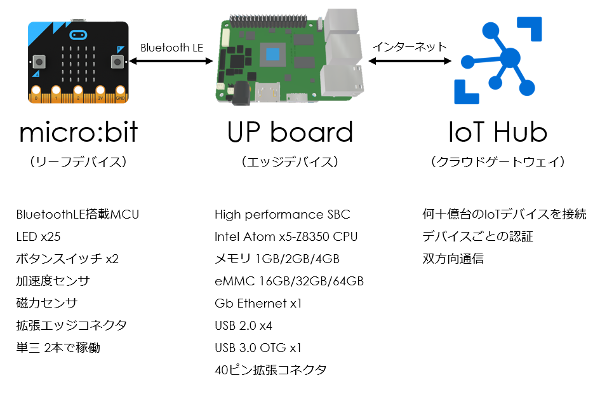

#### IoT Edge v2にモノ（リーフデバイス）を接続してみよう！ ([目次](readme.md))

# はじめに

本テキストはIoT Edge v2を使った、リーフデバイスからエッジデバイス、クラウドゲートウェイまでの構築手引きです。

クラウドゲートウェイはIoT Hubを使います。  
エッジデバイスはIoT Edgeで、windows-amd64/linux-amd64/linux-arm32v7向けのソフトウェア（Dockerイメージ）が提供されていますが、linux-amd64で開発されているようなので、UPボード+Ubuntu Linuxにします。  
リーフデバイスはマイクロソフトから提供されているものはありません。（[Azure Sphere](https://azure.microsoft.com/ja-jp/services/sphere/) MCUというのが発表されましたが、入手できるようになるのはまだ先のようですね。）
なにを使おうか迷ったのですが、Bluetooth LE通信で、入手しやすくセットアップが簡単、将来ハードウェア拡張もできるデバイスが良いなと思い、micro:bitを使うことにします。

|役割|サービス|ハードウェア|OS|
|:--|:--|:--|:--|
|クラウドゲートウェイ|[IoT Hub](https://azure.microsoft.com/ja-jp/services/iot-hub/)|-|-|
|エッジデバイス|[IoT Edge](https://azure.microsoft.com/ja-jp/services/iot-edge/)|[UPボード](http://www.up-board.org/up/)|[Ubuntu Linux](https://www.ubuntu.com/)|
|リーフデバイス|-|[micro:bit](http://microbit.org/ja/guide/)|-|

## 必要なもの

### IoT Hub

* **Azureアカウント** ... IoT Hub、IoT Edge、コンテナレジストリの作成、利用に使います。（コンテナレジストリはプライベートなIoT Edgeモジュールを作るときに使う。）

### UPボード

* **[UPボード メモリ4GB、eMMC64GB、ファン無し](https://up-shop.org/up-boards/44-up-board-4gb-ram-64-gb-emmc.html)** ... 騒音を気にしないならファン有りのほうが良い。
* **[UP用ABSプラスチックケース](https://up-shop.org/up-peripherals/9-case-abs-plastic.html)** ... あったほうが良い。
* **[ACアダプタ 5V 6.2A](http://akizukidenshi.com/catalog/g/gM-11105/)**
* **USB日本語キーボード** ... セットアップのときに使う。
* **ディスプレイ** ... セットアップのときに使う。
* **HDMIケーブル** ... セットアップのときに使う。
* **USBメモリ（8GB以上）** ... Ubuntu Linuxのインストールに使う。
* **[Bluetooth LE通信USBドングル](http://amzn.asia/fZs8rdI)** ... LinuxのBlueZが対応しているBluetooth LE通信用USBドングル。

UPボードは[通販サイト](https://up-shop.org/)から購入、日本へ発送が可能です。
日本でも取り扱っている販売店がいくつかありますので、手続き上、海外からの購入が難しい場合は販売店に問い合わせしてみてください。（「up board 購入」でGoogle検索すると、数社でてきます。）  
メモリが1GB/2GB/4GB、eMMCが16GB/32GB/64GB、ファン有無、で7モデル販売されていますが**メモリが2GB以上**のモデルを購入してください。

> 本テキストはメモリ4GB、eMMC64GB、ファン無しを使って作成しています。
> わたしが購入したときは、送料は$42でした。即日発送されて、FedExの輸送が6日間でした。

UPボードへの電源供給はDC5Vですが、ACアダプタはUPボードに同封されていませんので、別途購入が必要です。

### micro:bit

* **[micro:bit](https://www.marutsu.co.jp/pc/i/839895/)**
* **[micro:bit電池ホルダー](https://www.marutsu.co.jp/pc/i/839848/)** ... あったほうが良い。

micro:bitは取り扱っている販売店がたくさんありますので、入手には困らないでしょう。
