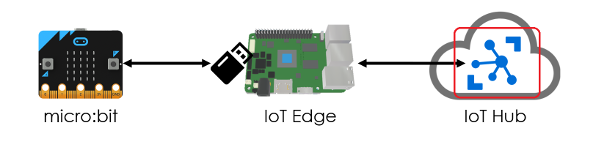
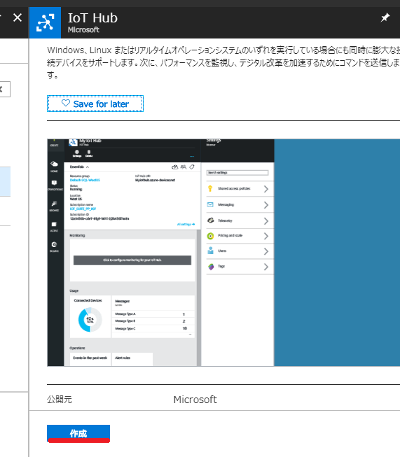
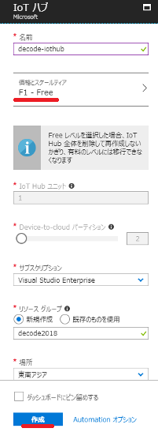
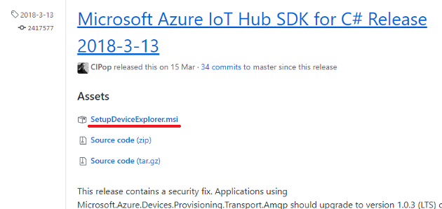
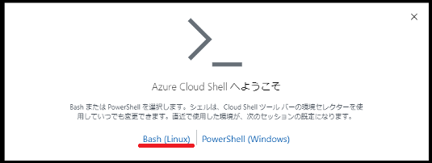
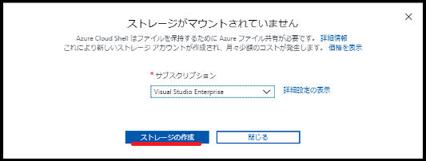

#### IoT Edge v2にモノ（リーフデバイス）を接続してみよう！ ([目次](readme.md))

# IoT Hubをセットアップ



AzureにIoT Hubを作成します。
デバイスからIoT Hubに送られてきたメッセージを確認するのにDevice Explorerやiothub-explorerを使用するので、どちらかのツールをインストールしてください。

## IoT Hubを作成

1. [Azureポータル](https://portal.azure.com)にログインして、リソースの作成にある`IoT Hub`を探します。そして、`作成`をクリックします。  

1. 名前とリソースグループを入力、価格とスケールティアを`Free`もしくは`Standard`にして、`作成`をクリックします。  


## メッセージ確認用ツールをインストール(オプション)

Azureポータルには、デバイスからIoT Hubに送信されたメッセージを確認する機能がありません。メッセージを確認したいときはDevice Explorerやiothub-explorerを使います。  
使用している環境に合わせて、いずれかのツールをインストールしてください。

### (Windowsの場合)Device Explorerをインストール

1. [azure-iot-sdk-csharpリポジトリのリリース](https://github.com/Azure/azure-iot-sdk-csharp/releases)から、`SetupDeviceExplorer.msi`をダウンロードして実行します。  


### (Macの場合)iothub-explorerをインストール

> このセクションは実機で動作確認していません。こちらを参考にがんばってください。
> * [Installing iothub-explorer](https://github.com/Azure/iothub-explorer)
> * [MACからでもデバイス登録可能だよ。IoTHub-Explorer紹介](https://blogs.msdn.microsoft.com/hirosho/2016/11/29/introduce_iothub_explorer_tool/)

```bash
npm install -g iothub-explorer
```

### (Webで使用)iothub-explorerをCloud Shellにセットアップ

#### Cloud Shellをセットアップ

1. Azureポータルの上部にある、`Cloud Shell`をクリックします。  

1. `Bash(Linux)`をクリックします。  

1. `ストレージの作成`をクリックします。  


#### iothub-explorerをインストール

```bash
mkdir ~/.npm-global
npm config set prefix '~/.npm-global'
npm install -g iothub-explorer
echo 'export PATH=~/.npm-global/bin:$PATH' >> .bashrc
source .bashrc
```

#### iothub-explorerをテスト

```bash
$ iothub-explorer -V
1.2.1
$
```

## (参考)

* [ソリューションに適した IoT Hub のレベルを選択する](https://docs.microsoft.com/ja-jp/azure/iot-hub/iot-hub-scaling)
* [Device Explorer の利用開始方法](https://blogs.msdn.microsoft.com/jpazureiotblog/2017/12/12/device-explorer-%E3%81%AE%E5%88%A9%E7%94%A8%E9%96%8B%E5%A7%8B%E6%96%B9%E6%B3%95/)
* [MACからでもデバイス登録可能だよ。IoTHub-Explorer紹介](https://blogs.msdn.microsoft.com/hirosho/2016/11/29/introduce_iothub_explorer_tool/)
* [iothub-explorerをAzure Cloud Shellで使えるようにする](http://matsujirushi.hatenablog.jp/entry/2018/04/01/173651)