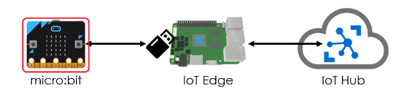
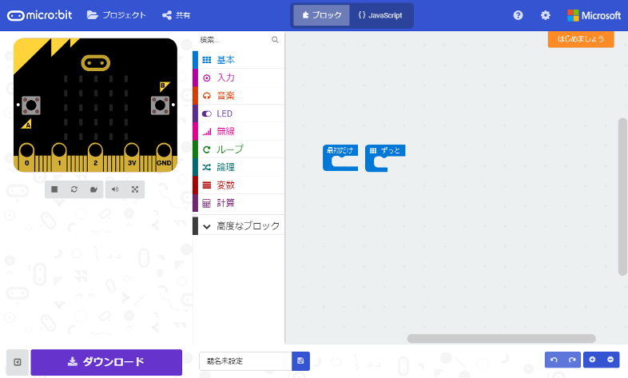
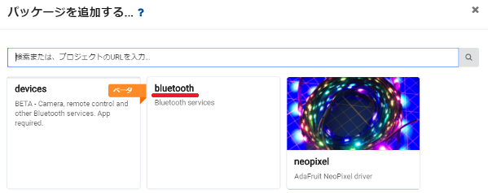
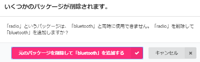
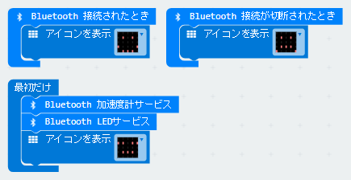

#### IoT Edge v2にモノ（リーフデバイス）を接続してみよう！ ([目次](readme.md))

# micro:bitをセットアップ



micro:bitにBluetooth LE通信するプログラムをインストールします。  
micro:bitの開発環境でmicro:bitに入れるプログラムを作成して、そのプログラムをmicro:bitへインストールします。Bluetooth LE通信は、開発環境で用意されているbluetoothパッケージを使用します。

## micro:bitのプロジェクト(プログラム)を作成(オプション)

> この手順をスキップして、本リポジトリから.HEXファイルをダウンロードすることも可能です。

1. Webブラウザで[micro:bitの開発環境](https://makecode.microbit.org/)を開きます。  

> 開発環境を開くと、最後に作業していたプロジェクトが表示されます。  
> クリアしたいときは、プロジェクト -> 新しいプロジェクト を選択してください。

2. `その他`（右上の歯車マーク） -> `パッケージを追加する` を選択して、`bluetooth`をクリックします。  

1. いくつかのパッケージが削除されます。と表示されたら、`元のパッケージを削除して「bluetooth」を追加する` をクリックします。  

1. JavaScript画面に切り替えてコードを入力、ブロック画面に戻して下図のとおり表示されていることを確認します。
```javascript
bluetooth.onBluetoothConnected(() => {
    basic.showIcon(IconNames.Happy)
})
bluetooth.onBluetoothDisconnected(() => {
    basic.showIcon(IconNames.Sad)
})
bluetooth.startAccelerometerService()
bluetooth.startLEDService()
basic.showIcon(IconNames.Asleep)
```


5. ダウンロードをクリックして、.HEXファイルをパソコンの適当なフォルダに保存します。

## micro:bitにプロジェクト（プログラム）を書き込む

1. micro:bitをパソコンにUSB接続します。すると、パソコンに`MICROBIT`という名前のドライブが表示されます。
1. `MICROBIT`ドライブに、.HEXファイルをコピーします。

> コピー後、`MICROBIT`ドライブが切断、接続されて、ドライブの中身に.HEXファイルが表示されませんが、正常な動作です。

