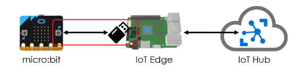
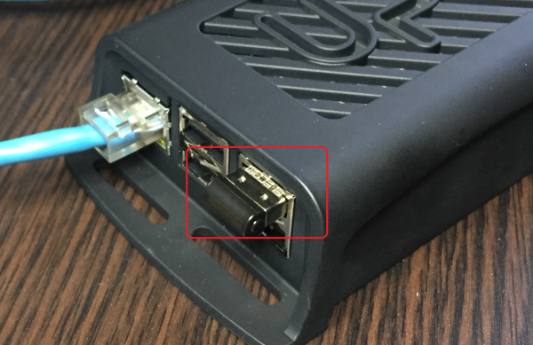

#### IoT Edge v2にモノ（リーフデバイス）を接続してみよう！ ([目次](readme.md))

# IoT Edgeにmicro:bitを登録



micro:bitとIoT EdgeをBluetooth LE通信できるようにします。  
IoT EdgeにBluetooth LE通信USBドングルを接続して、Linuxに最新のBlueZをインストールします。
その後、IoT Edgeとmicro:bitをペアリングします。

## USBドングルを取り付け

IoT EdgeにBluetooth LE通信USBドングルを取り付けます。  



## BlueZをインストール

LinuxにBluetoothプロトコルスタックのBlueZをインストールします。  
apt-getで簡単にインストールすることもできますが、この方法ではBlueZのバージョンが古く、BLE通信が上手くできませんでした。
必ず、**バージョン5.49**のソースをコンパイルしてインストールしてください。

```bash
sudo apt-get update
sudo apt-get install libglib2.0-dev libdbus-1-dev libudev-dev libical-dev libreadline-dev
wget http://www.kernel.org/pub/linux/bluetooth/bluez-5.49.tar.xz
tar xvf bluez-5.49.tar.xz
cd bluez-5.49
./configure
make
sudo make install
```

## BlueZを起動

BlueZを起動します。

```bash
sudo systemctl enable bluetooth
sudo systemctl start bluetooth
```

## ペアリング

1. micro:bitの`Aボタン`と`Bボタン`を押しながら、裏にある`RESETボタン`をクリックします。
`Aボタン`と`Bボタン`は`PAIRING`とLEDに表示されるまで押し続けてください。
(参考動画：[Put your micro:bit into pairing mode](https://youtu.be/wslwyAMwMhs?t=15s))
1. 

```bash
$ sudo bluetoothctl
[bluetooth]# power on
[bluetooth]# scan on
[NEW] Device D9:10:91:8A:58:D5 BBC micro:bit [vetup]
[bluetooth]# scan off
[bluetooth]# pair D9:10:91:8A:58:D5
Pairing successful
[bluetooth]# info D9:10:91:8A:58:D5
Device D9:10:91:8A:58:D5 (random)
        Name: BBC micro:bit [vetup]
        Alias: BBC micro:bit [vetup]
        Paired: yes
        Trusted: no
        Blocked: no
        Connected: no
        LegacyPairing: no
[bluetooth]# exit
```

## micro:bitの接続確認

bluetoothctlでconnectしたときに、micro:bitのLEDに`うれしい顔`が表示されれば正常です。

```bash
$ sudo bluetoothctl
[bluetooth]# connect D9:10:91:8A:58:D5
Connection successful
[BBC micro:bit]# disconnect
Successful disconnected
[bluetooth]# exit
```


## (参考)

* [BlueZ](http://www.bluez.org/)
* [README on BLueZ repo](https://git.kernel.org/pub/scm/bluetooth/bluez.git/tree/README)
* [Bluetooth Pairing](https://makecode.microbit.org/reference/bluetooth/bluetooth-pairing)
