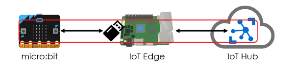
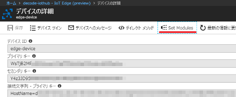
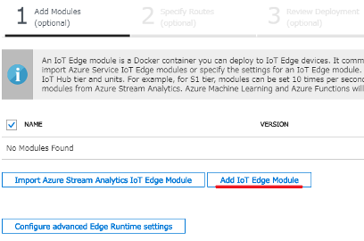
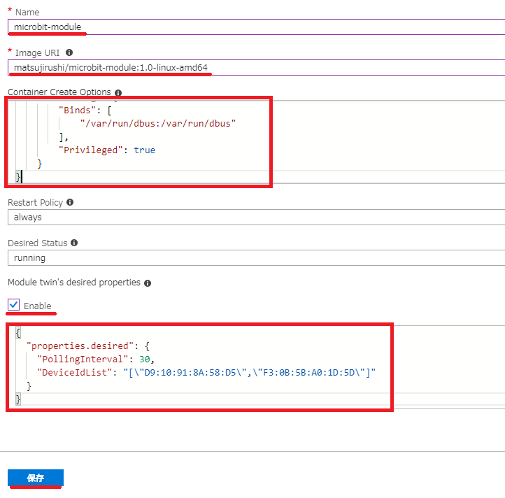
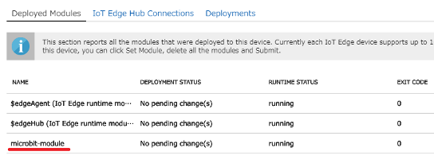
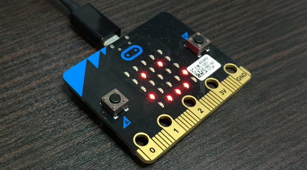
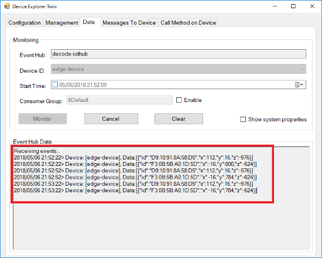

#### IoT Edge v2にモノ（リーフデバイス）を接続してみよう！ ([目次](readme.md))

# micro:bitとIoT Edge、IoT Hubの通信



IoT Edgeにモジュールを追加して、micro:bitの加速度を定期的にIoT Hubへ転送します。  
micro:bitの電源をオンして通信可能にしておき、IoT Hub上のIoT Edgeに`microbit-module`モジュールを追加します。  

## micro:bitの電源をオン

IoT Edgeとペアリングしてあるmicro:bitの電源をオンして、micro:bitのLEDに`ねむい顔`が表示されることを確認してください。
表示されていないときは、裏にある`RESETボタン`をクリックしてください。

> 現状のmicrobit-moduleは、モジュール起動前にmicro:bitを電源オンして通信可能な状態にしなければいけません。


## microbit-moduleを追加

1. 追加したIoT Edgeのデバイスの詳細画面で、`Set Modules`をクリックします。  

1. `Add IoT Edge Module`をクリックします。  

1. Name、Image URI、Container Create Options、Module twin's desired propertiesを下記のとおり入力して`保存`ボタンをクリックします。このとき、Module twin's desired propertiesの`DeviceIdList`はペアリングしたmicro:bitのIDに変更してください。  


**Name** ... `microbit-module`  
**Image URI** ... `matsujirushi/microbit-module:1.0-linux-amd64`  
**Container Create Options**
```json
{
    "HostConfig": {
        "Binds": [
            "/var/run/dbus:/var/run/dbus"
        ],
        "Privileged": true
    }
}
```
**Module twin's desired properties** ... `Enable`にチェック
```json
{
  "properties.desired": {
    "PollingInterval": 30,
    "DeviceIdList": "[\"D9:10:91:8A:58:D5\",\"F3:0B:5B:A0:1D:5D\"]"
  }
}
```

4. `Next` -> `Next` -> `Submit`をクリックします。
すると、Deployed Modulesにmicrobit-moduleが追加されます。  


1. 1～2分後に、micro:bitのLEDに`うれしい顔`が表示されれば正常です。  


## IoT Hubに送られたメッセージを確認

Device Explorerやiothub-explorerを使って、IoT EdgeからIoT Hubに加速度が送られているか確認してください。


