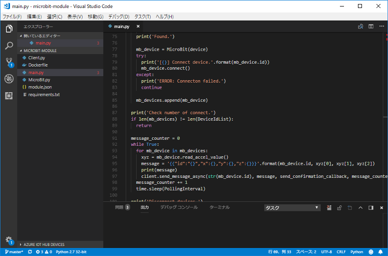
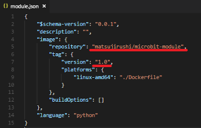
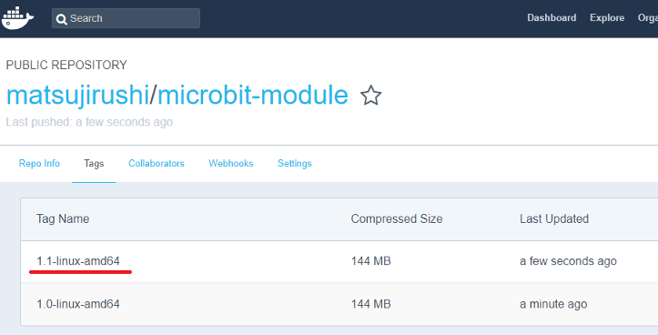
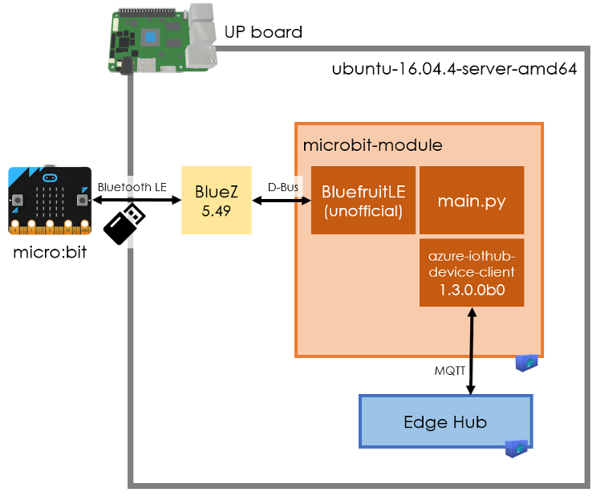

#### IoT Edge v2にモノ（リーフデバイス）を接続してみよう！ ([目次](readme.md))

# microbit-moduleの修正

IoT Edgeとmicro:bitの通信は`microbit-module`モジュールが行っています。  
ソースは本リポジトリの`src/iot-edge/microbit-module`にあり、このファイルをVisual Studio Codeで修正してDocker Hub（外部に公開したくない場合はAzureのContainer Registry）に登録して、IoT Edgeへのインストールを可能にします。

## 開発環境の準備

[Python IoT Edge モジュールを開発して、シミュレートされたデバイスにデプロイする](https://docs.microsoft.com/ja-jp/azure/iot-edge/tutorial-python-module)の前提条件と同じです。  
パソコンにVIsual Studio CodeとAzure IoT Edge拡張機能、Dockerをインストールします。（Python拡張機能、Python、Pipは不要な気がしますが、本当に不要かは確認していません。）

## ソースを修正

1. Visual Studio Codeで`ファイル` > `フォルダーを開く` を選択して、`src/iot-edge/microbit-module`を開きます。  

1. `main.py`や`MicroBit.py`、`Client.py`を修正します。
1. 必要に応じて、`module.json`に書かれている`repository`や`version`を変更します。  

## Dockerイメージを作成

1. Dockerを起動しておき、Visual Studio Codeの`module.json`を右クリック、`Build and Push IoT Edge Module Image`を選択、Select Platformに表示された`linux-amd64`を選択します。  

> Docker HubやContainer Registryへの認証が未設定のときは、`docker login`コマンドで設定してください。
1. Docker HubにDockerイメージがアップされました。  

## Bluetooth LE通信の仕組みとハマりどころ

DockerコンテナからBluetooth LE通信するにあたり、様々な障壁がありました。

* BlueZのバージョン ... 古いバージョンだと不安定
* Python用ライブラリ ... BlueZとの相性
* BluefruitLEのバージョン ... BLueZバージョンとの相性（D-Busプロトコルの互換性問題）
* device-clientのバージョン ... 最新だとEdge Hubに接続できない
* Dockerコンテナの境界 ... HCI? D-Bus?
* Docker起動パラメータ ... IoT Edgeで指定できないパラメータがある

たどり着いた、現時点のベストプラクティスがこちらです。

## (参考)

* [Python IoT Edge モジュールを開発して、シミュレートされたデバイスにデプロイする](https://docs.microsoft.com/ja-jp/azure/iot-edge/tutorial-python-module)
