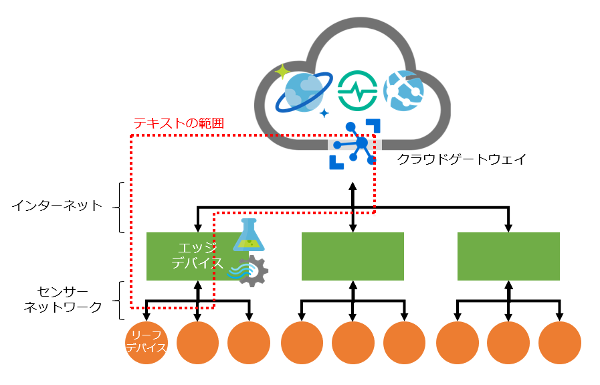

## IoT Edge v2にモノ（リーフデバイス）を接続してみよう！

### 概要

IoT Edge v2は、モノに取り付けたリーフデバイスから情報を収集してStream AnalyticsやAzure MLで分析、アクションすることに真価があります。それなのに、リーフデバイスをIoT Edge v2に繋ぐ部分の具体的な事例、手順はほとんど見当たりません。（わたしは見つけられなかった）  
そこで、IoT Edge v2にBluetooth LE通信のリーフデバイスを接続するサンプルコードとステップバイステップ形式のテキストを作ってみました。この資料に刺激されて、読者が実際に試して体感してもらうことを期待します。

### サンプルコードとテキスト

サンプルコードは`/src`、テキストは`/doc`にあります。  
テキストの入口は[こちら](doc/readme.md)です。

### 問合せ先

本リポジトリのIssueにどうぞ。

### 著作権表示

(C) 2018 Takashi Matsuoka  
本コンテンツの著作権、および本コンテンツ中に出てくる商標権、団体名、ロゴ、製品、サービスなどはそれぞれ、各権利保有者に帰属します。
